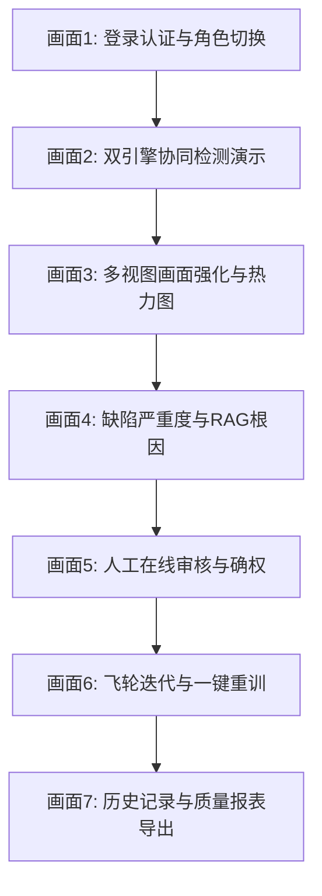

# SteelEye 钢铁表面缺陷智能检测系统 — 培训与验收指南

本指南旨在为实施工程师（IMPL）、项目经理（PM）及客户方提供一套系统的**现场用户培训大纲**与**项目最终验收（UAT）方案**。

---

## 第一部分：现场用户培训大纲

本大纲用于指导在系统上线部署完成后，对现场操作人员进行的系统化实操培训。

### 1. 培训基本信息
* **培训对象**：现场质检员、车间主管、工艺工程师、车间系统管理员
* **培训时长**：预计 2 小时
* **培训形式**：现场讲授 + 系统实操演练 + 答疑交流
* **准备物资**：工控机运行环境（SteelEye 大屏已正常接入相机）、培训 PPT、操作速查卡（每人一张）

### 2. 培训日程表（2 小时）

| 模块时间 | 培训主题 | 详细培训内容 | 讲师与参与人员 |
| :--- | :--- | :--- | :--- |
| **00:00 - 00:20** (20m) | **系统概述与登录** | 1. 介绍 YOLO+VLM 双视觉引擎的设计初衷与优势 2. 演示不同角色账号登录（质检员/主管/工程师）与登出 | 实施工程师 (主讲) 全体培训人员 |
| **00:20 - 00:50** (30m) | **质检看板与实时监控** | 1. 模拟模式与实时相机模式切换 2. 演示四种视图（真彩/红外/边缘/偏光）的适用缺陷场景 3. 识别缺陷包围盒与英文标签映射（`CRACK`/`SCALE` 等） | 实施工程师 (演示) 现场质检员 (实操) |
| **00:50 - 01:20** (30m) | **人工复核与 RAG 诊断** | 1. 讲解缺陷严重度 A/B/C/D 四级评定算法 2. 演示对误判或漏检缺陷的**人工在线审核与修正**保存方法 3. 如何查阅 RAG 物理根因和工艺调整处置意见 | 实施工程师 (演示) 质检员、主管 (实操) |
| **01:20 - 01:40** (20m) | **飞轮迭代与报表导出** | 1. **主管**：历史记录多维筛选与 CSV/HTML 报告导出 2. **AI工程师**：Bad Case 收集面板、一键增量训练及进度条/Loss曲线图查看 | 实施工程师 (演示) 主管、AI工程师 |
| **01:40 - 02:00** (20m) | **实操考核与答疑** | 1. 随机抽问质检员执行缺陷修正并保存 2. 自由提问，记录用户反馈 | 全员参与 |

---

## 第二部分：配套操作演示视频脚本 (5 分钟)

本脚本用于录制现场实操演示视频，作为用户后续学习的数字化课件。

* **视频总长**：约 5 分钟
* **画外音格式**：专业、清晰的工业级普通话配音
* **画面展示**：工控机 SteelEye 大屏 UI 界面录屏

### 视频分镜头脚本详细设计：

* **【画面 1：登录认证与角色切换】 (0:00 - 0:40)**
  * *视频画面*：光标移动，输入用户名 `inspector`，密码 `123456`，点击登录，进入主大屏，背景浮现深色网格与激光扫掠动画。
  * *旁白配音*：**“欢迎使用 SteelEye 钢铁表面缺陷智能检测系统。系统支持严密的角色权限管理，我们首先以现场质检员账号进行登录。”**
* **【画面 2：双引擎协同检测演示】 (0:40 - 1:20)**
  * *视频画面*：质检员点击“模拟 Preset 标样库”中的“氧化皮 (rolled-in_scale)”，点击“开始检测”。激光线由上至下扫过钢板，图像上瞬间圈出数个蓝色包围盒，标注 `SCALE`，并显示置信度。
  * *旁白配音*：**“点击开始检测后，系统仅需 10 毫秒即可由 YOLO 算法锁定缺陷位置。本系统支持 YOLO 毫秒级筛查与大模型精细复核协同作业，极速捕获产线异常。”**
* **【画面 3：多视图画面强化与热力图】 (1:20 - 2:00)**
  * *视频画面*：演示依次点击“边缘提取”、“偏光强化”按钮。钢板图像瞬间转化为黑白高亮轮廓和拉伸对比度后的偏光图；勾选“显示缺陷密度热力图”，画面叠加红色热力场。
  * *旁白配音*：**“为了辅助人工观察，系统内置了多种偏光、红外及 Canny 边缘提取算法。通过热力图模式，可以直观锁定缺陷的密度高发区域，反向追溯辊面磨损。”**
* **【画面 4：缺陷严重度与 RAG 根因】 (2:00 - 2:40)**
  * *视频画面*：镜头平滑移动到右侧分析面板，滚轮下滑，展示标记为 A 级的缺陷卡片，下方自动展开冶金物理成因分析和具体的停机检查排查步骤。
  * *旁白配音*：**“系统自动根据面积与置信度对缺陷进行严重度评级，A 级缺陷将触发紧急处置警告。结合 RAG 技术，系统可智能检索本地冶金手册，自动生成精准的缺陷成因分析与工艺处置方案，辅助一线决策。”**
* **【画面 5：人工在线审核与确权】 (2:40 - 3:30)**
  * *视频画面*：质检员发现一个边缘杂点被错判为划痕，点击卡片旁“修正”，在对话框中改为“麻点 (pitted_surface)”，严重度改为 D，输入备注：“边缘轻微噪点已修正”，点击保存。页面刷新，卡片状态更新为已审核，并归入 Bad Case 面板。
  * *旁白配音*：**“对于 AI 判定的边缘存疑数据，质检员可一键进行修正和确权。审核后的记录将被自动存入 SQLite 加密数据库。低于 0.5 置信度的异常数据会被自动收集为 Bad Case，用于后续的模型重训。”**
* **【画面 6：飞轮迭代与一键重训】 (3:30 - 4:20)**
  * *视频画面*：登出，重新以 `ai_engineer` 登录，进入数据飞轮面板。显示“待重训 Bad Case 样本：15 个”，点击“开始重训”。训练进度条启动（1/50...），下方的 Loss 与 mAP 折线图动态向右画出曲线。
  * *旁白配音*：**“AI工程师登录系统后，可使用数据飞轮控制台。一键点击开始重训，后台会自动将积累的 Bad Case 合并到底库进行全量混合训练，实时渲染进度与精度指标，实现数据闭环。”**
* **【画面 7：历史记录与质量报表导出】 (4:20 - 5:00)**
  * *视频画面*：登出并以主管 `supervisor` 登录。进入历史页，筛选“近 7 天 - 裂纹 - A级缺陷”，点击“导出 HTML 质量报告”，浏览器弹窗下载并打开一份带有 Plotly 交互饼图的精美报告网页。
  * *旁白配音*：**“车间主管可登录系统查阅全局质量指标。支持按时间、缺陷类型和严重度多条件筛选，一键导出 CSV 报表与可视化 HTML 报告，彻底打破数据孤岛。SteelEye 智能检测系统，让工业质检更简单、更精准。”**

---

## 第三部分：项目 UAT 验收标准与测试清单

本清单用于客户方（钢厂质量处、车间领导）与项目组进行最终系统验收时的标准对照。

### 1. 验收硬性指标 KPI

* **测试通过率**：单元测试与集成测试通过率必须达到 **100%**。
* **YOLO 推理延迟**：在 CPU 环境下，单张图片 YOLO 检测时间必须 **$\le$ 15ms**。
* **双引擎自动判定率**：系统自动检出并分类的比例必须 **$\ge$ 95%**，人工干预比率 $\le$ 5%。
* **综合缺陷检出率**：由原人工目视质检的 85% 综合检出率，提升至 **$\ge$ 98%**。

### 2. 功能验收检查清单 (Checklist)

| 功能模块 | 验收项 ID | 验收测试内容 | 期望输出结果 | 确认状态 |
| :--- | :--- | :--- | :--- | :--- |
| **用户认证** | UAT-01 | 输入 `admin/123456` 执行登录 | 成功进入系统，且顶部显示当前账号为 `admin` | [ ] |
| **用户认证** | UAT-02 | 尝试未登录直接访问 `/api/detect` 或前端大屏 | 系统自动拦截并重定向至登录页 | [ ] |
| **实时检测** | UAT-03 | 模拟模式下选择 `crazing` 标样并触发检测 | 1. 50ms 内完成检测并绘制红色 Bounding Box 2. 标签显示为 `CRACK` | [ ] |
| **画面强化** | UAT-04 | 点击“边缘提取”与“偏光强化”按钮 | 图像区域正确显示 Canny 轮廓图与高对比度偏光图 | [ ] |
| **自动分级** | UAT-05 | 检测出大面积划痕缺陷 | 缺陷卡片自动评定为 **A级 (严重)**，并呈红色警告 | [ ] |
| **RAG 诊断** | UAT-06 | 展开任一检出缺陷卡片 | 卡片下侧正确显示由 RAG 匹配出的物理根因分析与对策 | [ ] |
| **人工审核** | UAT-07 | 对已检出结果进行修正（如划痕改为裂纹）并提交 | 1. 数据库对应的 `detections` 修改成功 2. 审核状态更新为 `已审核 (corrected)` | [ ] |
| **数据飞轮** | UAT-08 | AI 工程师进入飞轮面板，点击“开始增量训练” | 1. 进度条正常刷新，动态显示当前 Epoch 数 2. 训练完毕后，`best.pt` 权重文件被自动覆盖更新 | [ ] |
| **报告导出** | UAT-09 | 质检主管执行“导出 HTML 可视化报告” | 本地生成一份包含缺陷比例饼图、趋势折线图的独立网页报告 | [ ] |
| **容错降级** | UAT-10 | 断开大模型 API 网络，执行实时检测 | 系统静默降级为 LocalAnalyzer，检测功能不中断并正常入库 | [ ] |
